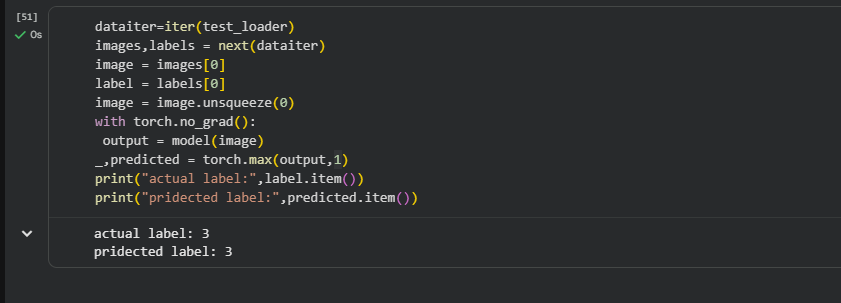

# MNIST-Digit-Classifier_CNN
My first CNN model built with PyTorch for handwritten digit classification.
  Handwritten Digit Classifier using CNN (PyTorch)

 Overview

This project is my first Convolutional Neural Network (CNN) built using PyTorch.

The model is trained on the MNIST handwritten digit dataset to recognize digits from 0–9.

 Features

- Built a CNN from scratch
- Trained using PyTorch
- Tested on unseen images
- Achieved **98% Test Accuracy**
- Save and Load trained model
- Predict single handwritten digit

 CNN Architecture

Input Image (1×28×28)

↓

Conv2D (32 Filters)

↓

ReLU

↓

MaxPool

↓

Flatten

↓

Linear (5408 → 128)

↓

ReLU

↓

Linear (128 → 10)

---

Result

- Training Dataset: 60,000 Images
- Test Dataset: 10,000 Images
- Accuracy: **98%**

 Technologies Used

- Python
- PyTorch
- Torchvision
- Google Colab
- Matplotlib

# Sample Prediction

Model successfully predicts handwritten digits from the MNIST dataset.

Example:

Actual Label: 2

Predicted Label: 2 

 What I Learned

- Dataset & DataLoader
- CNN Architecture
- Conv2D
- ReLU
- MaxPooling
- Flatten Layer
- Linear Layer
- CrossEntropyLoss
- Adam Optimizer
- Backpropagation
- Model Evaluation
- Save & Load Model
- Single Image Prediction
- 

## Sample Prediction

 Author

Nithesh y

Learning Artificial Intelligence & Machine Learning 🚀
